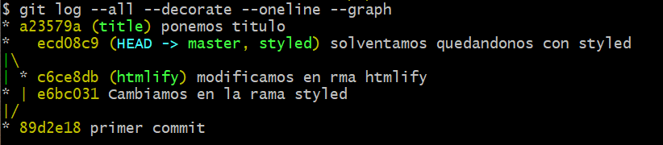

# Adrian Perez

paso 11   utilizo <git reset hard head ~1>  deshace y borra nuestro trabajo incluido el working copy

paso 12 git reflog para ver los movimiento y coger el identificador y git reset 'HEAD@{1}

paso 13  git merge master, no porque todos los commit de master ya se encontraban en styled

paso 19. git checkout styled,git merge htmlify, crea conflicto porque se esta modificando el mismo fichero en dos ramas

paso 21. git checkout master,git merge styled

paso 25. git log --all --decorate --oneline --graph

paso 26. si, porque no hay conflictos

paso 27. git reset --soft head~1

paso 28. git reset --hard

paso.29 git branch -D title

paso 30.git reset 'HEAD@{2}'

paso 32.git reflog, git reset 'HEAD@{20}'

paso 33.git reflog, git reset 'HEAD@{6}'

